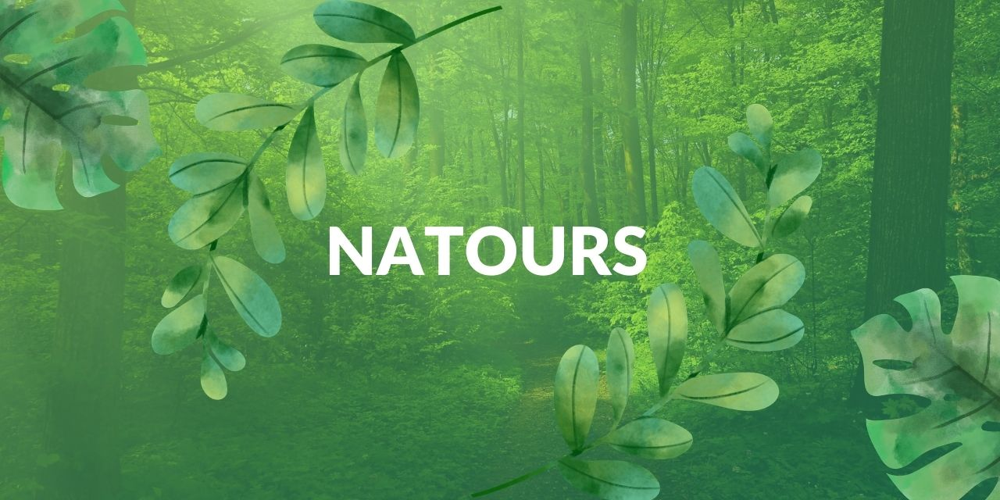

## Natours Project

***

#### Introduction

***

This tour booking portal is made to give user an experience to book the tours and bring recreation to their life.

#### Tech Stack

***

- 
- 
- 
- 

#### Installation

No such Installation is required. Although to process code following commands are used:- 

###### To Compile SASS

`npm run compile:sass`

###### To Comile and Watch SASS

`npm run start`

###### To Concat CSS

`npm run concat:css`

###### To Prefix CSS

`npm run prefix:css`

###### To Compress CSS

`npm run compress:css`

###### To Build Css

i.e To Concat, Prefix & Compress CSS

`npm run build:css`

> Happily turning COFFEE into CODE!